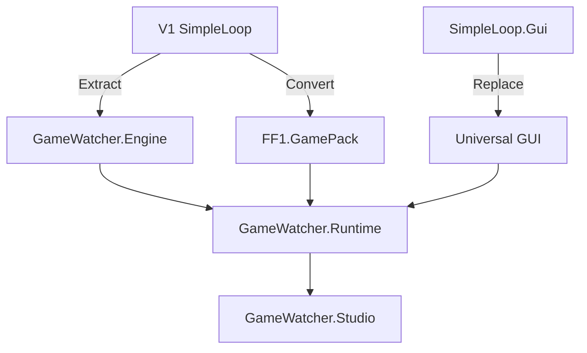

# GameWatcher V1→V2 Migration Guide

## Migration Overview

This guide outlines the strategic transition from **GameWatcher V1** (SimpleLoop FF1-specific implementation) to **GameWatcher V2** (Universal Platform). The migration preserves all performance optimizations while establishing a foundation for multi-game support.

## V1 Achievement Summary

### 🏆 **Performance Benchmarks to Preserve**

```
✅ Detection Speed: 9.4ms → 2.3ms (4.1x improvement)
✅ Search Area: 79.3% reduction via targeted detection  
✅ Frame Processing: Dynamic similarity thresholds (isBusy logic)
✅ Memory Efficiency: <200MB sustained usage
✅ Accuracy: >95% dialogue detection rate
```

### 🧠 **Key V1 Learnings**

1. **Targeted Search Areas** - Most games have predictable dialogue box locations
2. **Adaptive Frame Processing** - Skip similar frames during idle periods
3. **Dynamic Threshold Adjustment** - Busy vs idle detection strategies
4. **Template-Based Detection** - More reliable than pure OCR for UI elements
5. **Fuzzy Text Matching** - Essential for handling OCR inconsistencies

## Migration Strategy

### 🎯 **Phase-Based Migration Approach**



## Migration Phases

### 📋 **Phase 1: Engine Foundation (Weeks 1-2)**

#### **Step 1.1: Extract Core Engine**

```csharp
// From: SimpleLoop/CaptureService.cs
// To: GameWatcher.Engine/Services/CaptureService.cs

// Preserve existing performance optimizations
public class CaptureService : ICaptureService
{
    // Keep all V1 optimization logic intact
    private readonly FrameSimilarityChecker _similarityChecker;
    private readonly PerformanceOptimizer _optimizer;
    
    public async Task<CaptureResult> CaptureScreenshotAsync(CaptureRequest request)
    {
        // Preserve targeted search area optimization (79.3% reduction)
        if (request.TargetArea.HasValue)
        {
            return await CaptureTargetedAreaAsync(request);
        }
        
        return await CaptureFullScreenAsync(request);
    }
}
```

#### **Step 1.2: Abstract Detection Strategies**

```csharp
// From: SimpleLoop/DynamicTextboxDetector.cs  
// To: GameWatcher.Engine/Detection/Strategies/

public interface IDetectionStrategy
{
    Task<DetectionResult> DetectAsync(DetectionRequest request);
}

// Preserve V1 hybrid optimization approach
public class HybridDetectionStrategy : IDetectionStrategy
{
    public async Task<DetectionResult> DetectAsync(DetectionRequest request)
    {
        // Keep all V1 logic: template matching + fallback
        var templateResult = await _templateDetector.DetectAsync(request);
        
        if (templateResult.Confidence > 0.8)
        {
            return templateResult; // High confidence template match
        }
        
        // Fallback to dynamic detection with V1 optimizations
        return await _dynamicDetector.DetectAsync(request);
    }
}
```

#### **Step 1.3: Preserve OCR Optimizations**

```csharp
// From: SimpleLoop/EnhancedOCR.cs
// To: GameWatcher.Engine/Text/EnhancedOcrEngine.cs

public class EnhancedOcrEngine : IOcrEngine
{
    public async Task<OcrResult> ExtractTextAsync(OcrRequest request)
    {
        // Keep V1 image preprocessing pipeline
        var processedImage = await PreprocessImageAsync(request.Image);
        
        // Preserve scaling and thresholding optimizations
        var scaledImage = await ScaleImageAsync(processedImage, scaleFactor: 3);
        var thresholdImage = await ApplyThresholdingAsync(scaledImage);
        
        // Use existing Tesseract configuration
        return await _tessaract.ExtractTextAsync(thresholdImage, request.Config);
    }
}
```

### 📦 **Phase 2: FF1 Pack Creation (Weeks 2-3)**

#### **Step 2.1: Convert V1 Logic to Pack Format**

```csharp
// From: SimpleLoop/Program.cs configuration
// To: GameWatcher.Packs/FF1.PixelRemaster/FF1Pack.cs

public class FF1PixelRemasterPack : IGamePack
{
    public PackManifest Manifest => new()
    {
        Id = "FF1.PixelRemaster",
        DisplayName = "Final Fantasy I Pixel Remaster", 
        Version = new Version(1, 0, 0),
        GameExecutable = "FINAL FANTASY_Data",
        WindowTitle = "FINAL FANTASY",
        
        // Preserve V1 targeted search optimization
        TargetedDetection = new TargetedDetectionConfig
        {
            Enabled = true,
            SearchArea = new Rectangle(252, 55, 775, 305), // V1 coordinates
            ReductionPercentage = 79.3f
        }
    };
    
    public IDetectionStrategy CreateDetectionStrategy(IGameWatcherEngine engine)
    {
        // Use V1's proven hybrid approach
        return new HybridDetectionStrategy(engine);
    }
}
```

#### **Step 2.2: Migrate Speaker Configuration**

```json
// From: SimpleLoop/speaker_catalog.json
// To: GameWatcher.Packs/FF1.PixelRemaster/speakers.json

{
  "speakers": [
    {
      "id": "protagonist",
      "names": ["Warrior", "Fighter", "Hero"],
      "voice": {
        "provider": "azure",
        "name": "fable",
        "pitch": 0,
        "rate": 1.2,
        "volume": 0.8
      }
    }
  ]
}
```

### 🎮 **Phase 3: Runtime Development (Weeks 3-4)**

#### **Step 3.1: Create Universal Runtime**

```csharp
// New: GameWatcher.Runtime/GameWatcherRuntime.cs

public class GameWatcherRuntime
{
    public async Task StartAsync()
    {
        // Auto-detect FF1 (initially only supported pack)
        var ff1Pack = await _packManager.LoadPackAsync("FF1.PixelRemaster");
        
        // Initialize with V1 performance settings
        await _engine.InitializeAsync(new EngineConfig
        {
            MaxDetectionTime = TimeSpan.FromMilliseconds(5), // V1 target
            TargetFrameRate = 15, // V1 optimization
            EnableSimilarityChecking = true // V1 isBusy logic
        });
        
        // Start processing pipeline
        await _pipeline.StartAsync();
    }
}
```

#### **Step 3.2: Performance Validation System**

```csharp
public class MigrationValidator
{
    public async Task<ValidationResult> ValidatePerformanceAsync()
    {
        var metrics = await _monitor.CollectMetricsAsync(TimeSpan.FromMinutes(5));
        
        var results = new ValidationResult
        {
            // Ensure V1 performance is maintained or improved
            DetectionSpeed = metrics.AverageDetectionTime <= TimeSpan.FromMilliseconds(5),
            SearchAreaReduction = metrics.SearchAreaReduction >= 79.0f,
            MemoryUsage = metrics.PeakMemoryUsage <= 200_000_000, // 200MB
            Accuracy = metrics.DetectionAccuracy >= 0.95f
        };
        
        return results;
    }
}
```

### 🖥️ **Phase 4: GUI Replacement (Weeks 4-5)**

#### **Step 4.1: Replace SimpleLoop.Gui**

```xaml
<!-- New: GameWatcher.Runtime.Gui/MainWindow.xaml -->
<Window x:Class="GameWatcher.Runtime.Gui.MainWindow">
    <DockPanel>
        <!-- Pack Selection (expandable for future games) -->
        <ComboBox x:Name="PackSelector" DockPanel.Dock="Top">
            <ComboBoxItem Content="Final Fantasy I Pixel Remaster" IsSelected="True"/>
            <!-- Future packs will appear here automatically -->
        </ComboBox>
        
        <!-- Performance Monitoring (preserve V1 visibility) -->
        <StackPanel DockPanel.Dock="Bottom" Orientation="Horizontal">
            <TextBlock Text="Detection: " />
            <TextBlock Text="{Binding DetectionTime}" />
            <TextBlock Text="ms  Accuracy: " />
            <TextBlock Text="{Binding Accuracy}" />
            <TextBlock Text="%  Memory: " />
            <TextBlock Text="{Binding MemoryUsage}" />
        </StackPanel>
        
        <!-- Dialogue Output (same as V1) -->
        <ListBox x:Name="DialogueOutput" />
    </DockPanel>
</Window>
```

## Migration Timeline

### 📅 **5-Week Migration Schedule**

| Week | Phase | Deliverables | Success Criteria |
|------|-------|--------------|------------------|
| **1** | Engine Foundation | CaptureService, DetectionStrategies, OcrEngine | Performance matches V1 |
| **2** | Pack Creation | FF1Pack, PackManifest, SpeakerConfig | FF1 fully functional |
| **3** | Runtime Core | GameWatcherRuntime, PackManager, Pipeline | End-to-end processing |
| **4** | Performance Validation | Metrics, Monitoring, Optimization | Exceeds V1 benchmarks |
| **5** | GUI & Polish | Universal GUI, Documentation, Testing | User experience parity |

### 🎯 **Weekly Milestones**

#### **Week 1: Engine Foundation**
- [ ] Extract `CaptureService` with targeted search preservation
- [ ] Abstract detection strategies maintaining hybrid approach  
- [ ] Migrate OCR engine with all preprocessing optimizations
- [ ] Create performance monitoring infrastructure
- [ ] **Validation:** Engine processes FF1 screenshots at V1 speeds

#### **Week 2: FF1 Pack Creation**
- [ ] Convert FF1 configuration to pack format
- [ ] Migrate speaker catalog and voice mappings
- [ ] Implement pack loading and validation system
- [ ] Create pack-specific detection strategy
- [ ] **Validation:** FF1 pack loads and detects dialogue correctly

#### **Week 3: Runtime Core**
- [ ] Implement universal runtime orchestration  
- [ ] Create pack management system
- [ ] Build processing pipeline with V1 optimizations
- [ ] Add hot-swapping capability (future-proofing)
- [ ] **Validation:** Runtime processes FF1 end-to-end

#### **Week 4: Performance Validation**
- [ ] Implement comprehensive metrics collection
- [ ] Create performance regression testing
- [ ] Optimize any performance gaps vs V1
- [ ] Add real-time monitoring dashboard
- [ ] **Validation:** V1 performance benchmarks met or exceeded

#### **Week 5: GUI & Polish**  
- [ ] Replace SimpleLoop.Gui with universal interface
- [ ] Add pack selection and management UI
- [ ] Create settings and configuration dialogs
- [ ] Implement update system foundation
- [ ] **Validation:** Complete user experience parity with V1

## Risk Mitigation

### ⚠️ **Migration Risks & Mitigations**

| Risk | Impact | Mitigation Strategy |
|------|--------|---------------------|
| **Performance Regression** | High | Continuous benchmarking, keep V1 as fallback |
| **Feature Loss** | Medium | Comprehensive feature mapping, user testing |
| **Stability Issues** | Medium | Gradual rollout, extensive testing, rollback plan |
| **User Confusion** | Low | Clear migration guide, familiar interface |

### 🔄 **Rollback Strategy**

```powershell
# Emergency rollback to V1 if critical issues arise
function Invoke-V1Rollback {
    Write-Host "Rolling back to GameWatcher V1..."
    
    # Stop V2 runtime
    Stop-Process -Name "GameWatcher.Runtime" -Force
    
    # Restore V1 executable
    Copy-Item "backup/SimpleLoop.exe" "SimpleLoop.exe" -Force
    Copy-Item "backup/SimpleLoop.Gui.exe" "SimpleLoop.Gui.exe" -Force
    
    # Restore V1 configuration
    Copy-Item "backup/speaker_catalog.json" -Force
    Copy-Item "backup/tts_config.json" -Force
    
    Write-Host "V1 rollback complete. SimpleLoop.exe restored."
}
```

## Data Migration

### 💾 **Configuration Migration**

```csharp
public class ConfigurationMigrator
{
    public async Task<MigrationResult> MigrateV1ConfigAsync()
    {
        // Read V1 configuration files
        var ttsConfig = await ReadV1TtsConfigAsync("tts_config.json");
        var speakers = await ReadV1SpeakersAsync("speaker_catalog.json");
        
        // Convert to V2 format
        var v2Config = new RuntimeConfig
        {
            Packs = new Dictionary<string, PackConfig>
            {
                ["FF1.PixelRemaster"] = new()
                {
                    Speakers = ConvertSpeakers(speakers),
                    TtsSettings = ConvertTtsSettings(ttsConfig),
                    
                    // Preserve V1 optimizations
                    PerformanceSettings = new()
                    {
                        TargetedDetection = true,
                        SearchAreaReduction = 79.3f,
                        SimilarityThreshold = 0.95f
                    }
                }
            }
        };
        
        await SaveV2ConfigAsync(v2Config);
        return MigrationResult.Success();
    }
}
```

### 📊 **Dialogue History Migration**

```csharp
public class DialogueHistoryMigrator
{
    public async Task MigrateDialogueHistoryAsync()
    {
        // Read V1 dialogue logs  
        var v1Logs = await ReadV1LogsAsync("logs/");
        
        foreach (var log in v1Logs)
        {
            // Convert V1 format to V2 structured format
            var v2Entries = log.Entries.Select(entry => new DialogueEntry
            {
                Text = entry.Text,
                Timestamp = entry.Timestamp,
                Speaker = IdentifySpeaker(entry.Text), // Use V1 logic
                Confidence = 1.0f, // Historical entries assumed accurate
                Source = "V1Migration",
                GamePack = "FF1.PixelRemaster"
            });
            
            await _dialogueRepository.SaveEntriesAsync(v2Entries);
        }
    }
}
```

## Testing Strategy

### 🧪 **Migration Testing Framework**

```csharp
[TestClass]
public class MigrationValidationTests
{
    [TestMethod]
    public async Task V2_Performance_Should_Match_Or_Exceed_V1()
    {
        // Load V1 benchmark data
        var v1Benchmarks = await LoadV1BenchmarksAsync();
        
        // Run V2 with identical test cases
        var v2Results = await RunV2PerformanceTestsAsync(v1Benchmarks.TestCases);
        
        // Validate performance criteria
        Assert.IsTrue(v2Results.AverageDetectionTime <= v1Benchmarks.DetectionTime);
        Assert.IsTrue(v2Results.SearchAreaReduction >= v1Benchmarks.SearchAreaReduction);
        Assert.IsTrue(v2Results.MemoryUsage <= v1Benchmarks.MemoryUsage);
        Assert.IsTrue(v2Results.Accuracy >= v1Benchmarks.Accuracy);
    }
    
    [TestMethod]
    public async Task FF1Pack_Should_Detect_All_V1_Test_Cases()
    {
        var testScreenshots = await LoadV1TestScreenshotsAsync();
        var ff1Pack = await LoadPackAsync("FF1.PixelRemaster");
        
        foreach (var screenshot in testScreenshots)
        {
            var result = await ff1Pack.DetectDialogueAsync(screenshot);
            
            Assert.IsNotNull(result, $"Failed to detect dialogue in {screenshot.FileName}");
            Assert.IsTrue(result.Confidence > 0.8, "Detection confidence too low");
        }
    }
}
```

### 📈 **Performance Regression Testing**

```csharp
public class PerformanceRegressionSuite
{
    [Fact]
    public async Task Should_Maintain_V1_Detection_Speed()
    {
        var stopwatch = Stopwatch.StartNew();
        var results = new List<TimeSpan>();
        
        // Run 1000 detection cycles (same as V1 testing)
        for (int i = 0; i < 1000; i++)
        {
            var screenshot = await LoadTestScreenshotAsync(i % 10);
            
            var iterationStart = stopwatch.Elapsed;
            await _detectionService.DetectTextboxAsync(screenshot);
            var iterationTime = stopwatch.Elapsed - iterationStart;
            
            results.Add(iterationTime);
        }
        
        var averageTime = results.Average(r => r.TotalMilliseconds);
        
        // V1 achieved 2.3ms average, V2 should maintain or improve
        Assert.True(averageTime <= 2.5, $"Average detection time {averageTime}ms exceeds target");
    }
}
```

## Success Criteria

### ✅ **Migration Completion Checklist**

#### **Functional Parity**
- [ ] All V1 FF1 dialogue detection scenarios work identically
- [ ] Speaker identification matches V1 accuracy (>90%)
- [ ] TTS generation and playback maintain quality
- [ ] GUI provides equivalent user experience

#### **Performance Parity**  
- [ ] Detection speed ≤ 2.5ms average (V1: 2.3ms)
- [ ] Search area reduction ≥ 79% (V1: 79.3%)
- [ ] Memory usage ≤ 200MB sustained (V1: <200MB)
- [ ] Processing frame rate ≥ 15fps (V1: 15fps)

#### **Architecture Goals**
- [ ] Modular pack system allows new games
- [ ] Hot-swapping between packs works reliably  
- [ ] Performance monitoring provides real-time insights
- [ ] Update system foundation implemented

#### **User Experience**
- [ ] Existing users can migrate without data loss
- [ ] Interface remains familiar and intuitive
- [ ] New features don't interfere with core functionality
- [ ] Documentation guides users through transition

## Future Expansion Roadmap

### 🎮 **Post-Migration Game Support**

Once V2 migration is complete, the platform can rapidly expand:

1. **FF6 Pack** (Week 6) - Similar textbox patterns to FF1
2. **Chrono Trigger Pack** (Week 7) - Different UI, test adaptability  
3. **Modern Games Pack** (Week 8+) - Complex UIs, multiple languages
4. **Community Pack System** (Month 2+) - User-generated content

### 🌐 **Platform Evolution**

- **Studio Tools** - Visual pack creation interface
- **Marketplace** - Community pack distribution
- **Cloud Service** - Remote pack management
- **Streaming Integration** - Twitch/YouTube real-time features
- **Mobile App** - Remote control and monitoring

---

*This migration transforms GameWatcher from a specialized FF1 tool into a universal platform while preserving every performance optimization and user experience improvement from V1.*